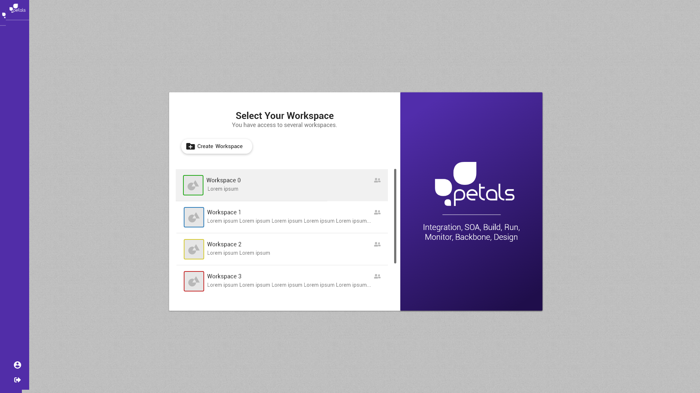

# Charger un espace de travail

Concepts associés : un **Espace de Travail**.  
Préconditions : [\[ Se connecter \]](se-connecter.md)  
Postconditions : [\[ Visualiser un Espace de Travail \]](visualiser-un-espace-de-travail.md)  
Contraintes : -  
Complexité : -

### Scénarios


Dans un scénario, on ne mentionne pas les actions techniques \(pas de clic, de tooltip, etc\).


**Scénario normal :** Albert veut sélectionner un espace de travail pour travailler. Plusieurs sont listés. Il sélectionne celui qui s'appelle **pre-prod** et valide son choix.   
  
**Scénario alternatif 1 :** Albert veut sélectionner un espace de travail pour travailler. Aucun n'est listé. Il peut donc soit [créer un nouvel espace de travail](definir-un-espace-de-travail.md), soit [se déconnecter](se-deconnecter.md).   
  
**Scénario alternatif 2 :** Albert veut sélectionner un espace de travail pour travailler. Plusieurs sont listés. Il sélectionne celui qui s'appelle **pre-prod** mais ne peut valider son choix. En effet, il n'a pas les droits suffisants. Il peut toutefois récupérer le nom de l'administrateur de cet espace pour prendre contact avec lui.

### Maquette illustrative


La phrase d'accroche de l'exemple sera changée en :  
"Build, Run, Monitor  
your SOA integration backbone."


### Informations complémentaires pour implémentation

* La sélection d'un espace de travail se fait par simple clic sur la zone qui lui est dédiée dans la liste.
* Survoler une telle zone permet d'afficher un _tooltip_ avec la description intégrale de l'espace, le nom de son ou ses administrateurs, ainsi que le nombre de personnes y ayant accès. 
* La liste des espaces est triée. Ceux auxquels l'utilisateur a accès sont listés en premier. Les autres viennent après.
* Une icône \(ou un fond de couleur différente\) marque différemment les espaces auxquels l'utilisateur n'a pas accès.

