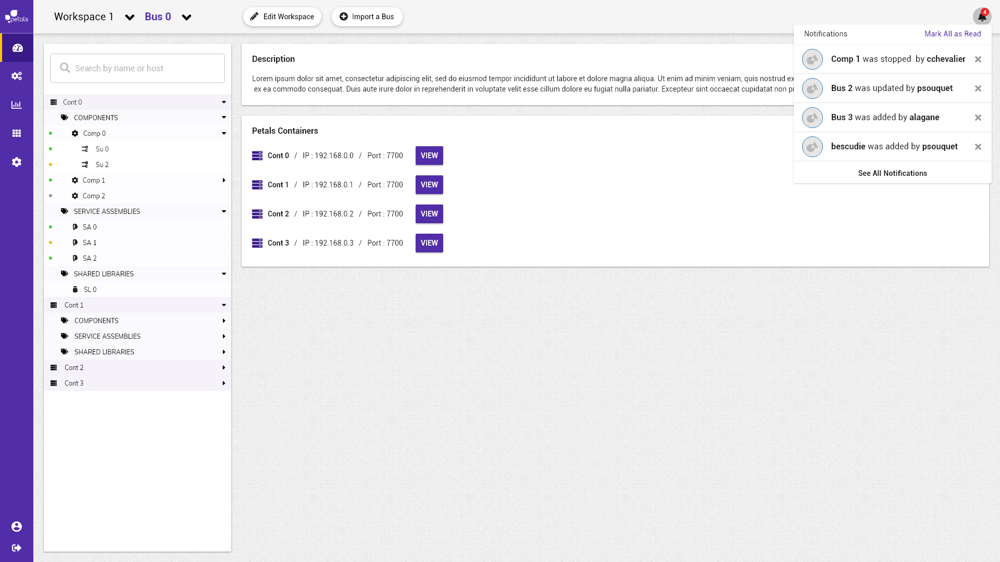

# Éditer un espace de travail


La notation suivante est prise :


* \[ tâche \] fait référence à une autre tâche.
* Action \(sans crochets\) fait référence à une action utilisateur.

Concepts associés : un **Espace de Travail**.  
Préconditions : [\[ Charger un Espace de Travail \]](charger-un-espace-de-travail.md)  
Postconditions : -  
Contraintes : -  
Complexité : -

### Scénarios


Dans un scénario, on ne mentionne pas les actions techniques \(pas de clic, de tooltip, etc\). 


**Scénario normal :** Albert veut éditer son espace de travail pour modifier la description. Il passe mode édition, change le texte, et valide son changement.

**Scénario alternatif 1 :** Albert veut éditer un espace de travail pour effectuer des changements dans la liste des membres ayant accès à l'espace de travail. Il souhaite ajouter un nouveau membre. Il saisi le nom filtré, sélectionne l'utilisateur parmi la liste déroulante, et ajoute le nouveau membre. La liste est mis à jour.

**Scénario alternatif 2 :** Albert veut éditer un espace de travail pour effectuer des changements dans la liste des membres ayant accès à l'espace de travail. Il souhaite supprimer un nouveau membre. Il cherche le membre parmi la liste et le supprime à l'aide de l'îcône de suppression. La liste est mis à jour.

### Maquette illustrative 

 

 

### Remarque

La bouton **Edit Workspace** ne sert plus à rien. On peut éditer directement sur la page.  
Le panel **Last Actions** ne sera pas développer pour le moment, autant faire une version sans.  
Du coup, la partie **Notifications** en haut à droite ne sera pas développer non plus.  

